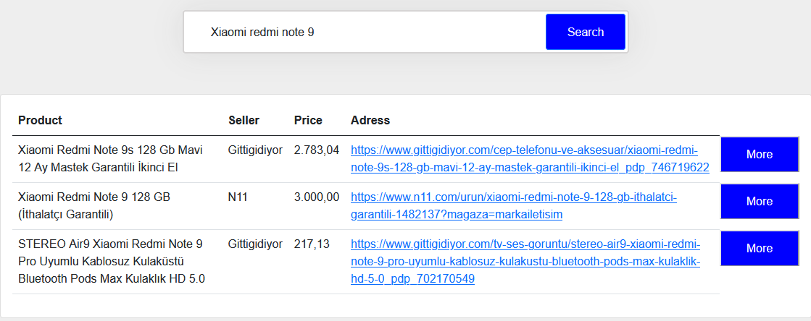
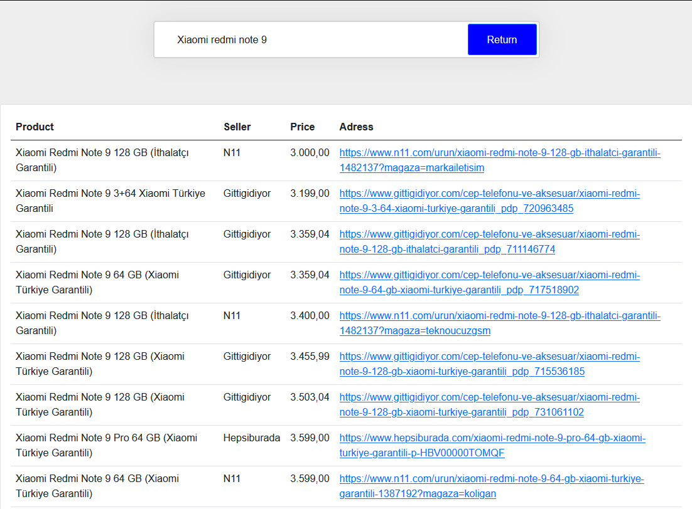

# Price Comparison: Data Scraping

A web project prepared for comparison of price information gathered from shopping websites through data scraping.

## Problem Definition

Efficiently sourcing and aggregating diverse items from various websites based on user search queries, followed by the precise identification and matching of these items within the acquired data.

## Proposed Solution

The proposed solution involves the creation of a comprehensive database by sourcing data from four prominent websites: Hepsiburada.com, n11.com, git-tigidiyor.com, and amazon.com.tr. This will be achieved through the customization of web crawlers, tailored to the structure of each website. The approach allows for easy addition of new product categories via category links. Focusing on category pages optimizes data extraction, enabling retrieval of up to 20-25 products with a single request. This systematic method ensures a reliable database with essential product details such as names, prices, and direct links.

## Used Technologies

- XPath
- Spider
- Scrapy
- HTML
- CSS
- JavaScript
- NodeJS
- MongoDB

## Implementation

Data management relies on MongoDB, a powerful database system, distributed across three clusters. JavaScript handles website functionality, while HTML and CSS create the site's appearance. MongoDB and regex are used to efficiently search and present results, with products listed by similarity and price for user convenience.

## Results

Developed website is capable of comparing prices for a wide range of products sourced from various websites. The implementation allowed for the extraction and comparison of product details from 4 popular e-commerce websites. The website's efficient web scraping capabilities enabled the collection of data for more than 100,000 products. Furthermore, the platform achieved an impressive accuracy rate in matching and comparing similar products across different websites. This resulted in significant time savings for users, with an average search process taking just 5 seconds, making it a highly efficient tool for price comparison.
